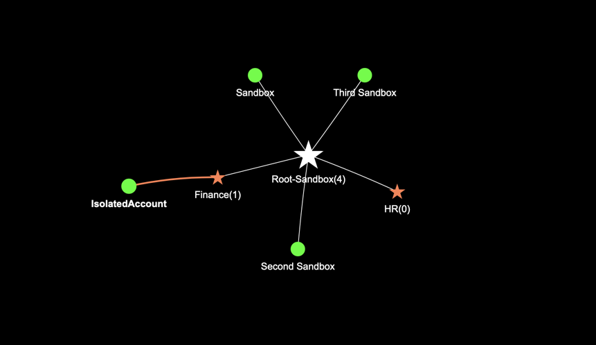

# Org Visualiser

## __1. Description__
A tool to visualise the AWS OU and account structure for a given org.

## __2. Motivation__
If you have many accounts and OUs it might be hard to have a picture of it in your head. This tools helps build a visualisation

## __3. Example__
Here is how a visualisation could look. This is, of course, a very simple set up with 2 OUs and 4 accounts, but for orgs that have hundreds or thousands of accounts, this would help get a bird's eye view of how their accounts are structured.



## __4. Permissions needed to run the script__

You can run the script org_visualise.py (or use the docker container) on an EC2 with an instance role, or on your own machine with the credentials exported using the usual AWS env variables (as below) or with a profile configured using `aws configure` CLI command

```
export AWS_ACCESS_KEY_ID=abc
export AWS_SECRET_ACCESS_KEY=def
export AWS_SESSION_TOKEN=ghi
```

These credentials are needed as the code will invoke AWS APIs to read accounts/OU details.

You can also provide an IAM role that the above provided profile can assume. To run this script, you can use a role with the AWS managed policy AWSOrganizationsReadOnlyAccess (arn:aws:iam::aws:policy/AWSOrganizationsReadOnlyAccess)

If you want the least privileged policy to run this, here is what the profile would need:

```
{
    "Version": "2012-10-17",
    "Statement": [
        {
            "Sid": "OrgvisMinimumPermissions",
            "Effect": "Allow",
            "Action": [
                "organizations:ListRoots",
                "organizations:DescribeOrganizationalUnit",
                "organizations:DescribeOrganization",
                "organizations:DescribeAccount",
                "sts:GetCallerIdentity",
                "organizations:ListChildren"
            ],
            "Resource": "*"
        }
    ]
}
```

This script can be run only on the management account, or on a child account that is a [delegated administrator for the AWS account management](https://docs.aws.amazon.com/accounts/latest/reference/using-orgs-delegated-admin.html).

## __4. Running the tool by using Python directly__

1. You will need Python 3.8.9+ or docker for this tool. If you do not have Python installed, please install it from here:
https://www.python.org/

2. Clone the repo and install the dependencies with the following command:
```
pip install -r requirements.txt
```

4. Once this is set up, you can run the script as below (make sure the packages mentioned in requirements.txt are installed)

```
python3 org_visualise.py
```

The html output will be written by default to output/output.html. You can change the output path/file name by using the option given below. The subfolder "output" or the subfolder(s) you specify in the -o option will be created if they do not exist.

Here are the different command line options that allow you to:
- generate the visualisation only for the OUs, or to include the accounts
- generate the visualisation in dark mode
- choose a different path/filename

```
python3 org_visualise.py -h
usage: org_visualise.py [-h] [-d depth] [-o output_file_name] [--dark-mode]
                        [--aws-profile aws_profile_name]
                        [--aws-assume-role aws_assume_role_name]
                        [--show-options] [--log-level log_level]

Generate AWS Account/Org structure visualizations

optional arguments:
  -h, --help            show this help message and exit
  -d depth, --depth depth
                        Indicate if the depth should be only upto the "ou" or
                        all the way to the "account" level. Default is
                        "account"
  -o output_file_name, --output output_file_name
                        Name of the html file to which the output will be
                        written to (you can include the path too. Either
                        relative to the current folder or the absolute path).
                        Please include the suffix ".html" in the filename.
                        Default is output/output.html
  --dark-mode           Use this option if you want the visualization with a
                        black background. Default is False
  --aws-profile aws_profile_name
                        Use this option if you want to pass in an AWS profile
                        already congigured for the CLI
  --aws-assume-role aws_assume_role_name
                        Use this option if you want the aws profile to assume
                        a role before querying Org related information
  --show-options        Use this option if you want the graph visualisation
                        options on the visualisation html. This will allow you
                        to try out many different possibilities (for example,
                        showing the graph as a hierarchy). Default is False
  --log-level log_level
                        Log level. Needs to be one of the following:
                        'DEBUG','INFO','WARNING','ERROR','CRITICAL'
```

## __5. Running the tool as a Docker container__

Instead of installing Python and the dependencies, you can just use the Docker file and run the tool as a container. Here is how to do it.

1. Clone the repo and bulid the image by running the command `docker build . -t org_visualiser`

2. If you are using an AWS profile use the following command (note how the credentials file is mapped into the container so that the container will have access to the credentials). Also note that the volume being mapped is the folder into which the output file to be written.If the folder(s) given in the path does not exist, the container will create it.

```
docker run \
    -v $HOME/.aws/credentials:/root/.aws/credentials:ro \
    -v $PWD/src/output/:/src/output/:rw \
    org_visualiser \
    --aws-profile madhav \
    -o output/output.html
```

3. If you are using AWS credentials exported as env variables you can run it as below. You can remove AWS_SESSION_TOKEN if you are using long term credentials

```
docker run \
    -v $PWD/src/output/:/src/output/:rw \
    -e AWS_ACCESS_KEY_ID \
    -e AWS_SECRET_ACCESS_KEY \
    -e AWS_SESSION_TOKEN \
    org_visualiser \
    -o output/output.html
```

4. If you are running on an EC2 machine with an IAM role associated with the machine, then you can just run it without env variables or credential files as below.

```
docker run \
    -v $PWD/src/output/:/src/output/:rw \
    org_visualiser \
    -o output/output.html
```

## __5. Design__
The execution flow is as below:
  1. Create a boto3 session (with the profile name provided. If no profile name is provided pass in an empty profile name)
  2. If an IAM role is passed in as a parameter, then assume that role by calling `sts.assume_role` and create a new boto3 session with the assume_role
  3. Create a boto3 `organizations` client.
  4. Get the root id using the API call `organizations.list_roots`
  5. Add the root to the list of nodes
  6. Call `organizations.list_children` to get all the accounts under the current OU/root and add them to the list of nodes with the parent as the current root/OU.
  7. Call `organizations.list_children` to get all OUs under the current OU/root and add them to the list  with the parent as the current root/OU.
  8. Recursively do the steps 6,7 until there are no OUs left. This will ensure that all OUs and Children are called.
  9. At this time all OUs and Children are added to the list of nodes.
  10. Then go through the list of nodes, and make the calls to `organizations.describe_organizational_unit` and `organizations.describe_account` and `organization.describe_organization` (for root) to get attributes like OU Name, Account Name, Account Status.
  11. Then add the children, OUs and the root as nodes and the parent child relationships as edges to a `networkx.DiGraph`
  12. Use the DFS algorithm on the above DiGraph to count children under each OU and add it to the OU's label for visulization.
  13. Write out the graph as a html page using the networkx module.

## __6. List of AWS APIs invoked__

```
organizations:ListRoots  
organizations:DescribeOrganization  
organizations:DescribeOrganizationalUnit  
organizations:DescribeAccount  
sts:GetCallerIdentity  
organizations:ListChildren  
```

## __Security__

See [CONTRIBUTING](CONTRIBUTING.md#security-issue-notifications) for more information.

## __License__

This library is licensed under the MIT-0 License. See the LICENSE file.

